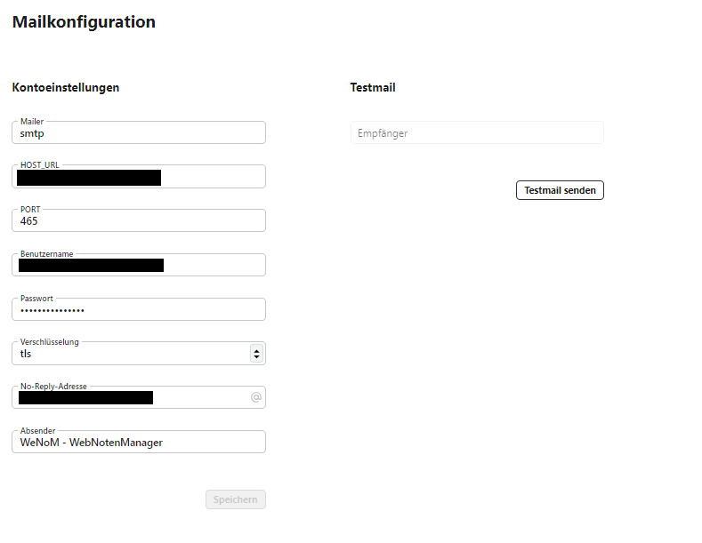

# WebNotenManager Handbuch


Der WebNotenManager (WeNoM) kann als Plattform außerhalb des Schulverwaltungsnetzes eingesetzt werden. Damit steht den Lehrkräften eine externe Möglichkeit zur Verfügung, ihre Noten, Teilnoten, Bemerkungen und Fehlstunden einzutragen. Die Daten können über eine sichere Verbindung mit dem SVWS-Server synchronisiert werden.

## Einrichtung 

### Systemvoraussetzungen

Zum Betrieb wird ein Apache- oder Nginx-Webserver mit PHP 8.2 benötigt. Zudem müssen die folgenden PHP-Module geladen sein: CLI, FPM, CURL, GD, MBSTRING, SOAP, BCOMP, Tokenizer, XML, XMLRPC, ZIP, MYSQL, PDO. Als Datenbank wird eine MariaDB Datenbank benötigt.

### Installationsanleitung

Weitere Informationen zu den Installationsschritten bzw. fertige Skripte finden Sie in der technischen Dokumentation zu unserem Open-Source-Projekt unter https://github.com/SVWS-NRW/SVWS-WebNotenManager/documentation/Installation/

### Konfigurationseinstellungen

Alle technischen Konfigurationseinstellungen werden in einer .env-Datei (Environment) gespeichert, die sich im Hauptverzeichnis befindet, in der Regel unter /app/webnotenmaneger/. Eine Beispieldatei befindet sich dort unter .env.example, die als Vorlage dienen kann. Die Einstellungen werden bei der Einrichtung der Software durch den technischen Administrator eingetragen. Hierbei sind die folgenden Variablen einzutragen: 

Variable    | Beispiel                      | Beschreibung
--------    | --------                      | ------------
APP_NAME    |"WeNoM - WebNotenManager"      | Name der Applikation 
APP_ENV     | production                    | local oder production gibt den Betriebsmodus an. I.d.R. Produktionsbetrieb
APP_KEY     | base64:aDumSS...              | Ein Verschlüsselungskey, der bei der Einrichtung generiert werden kann.
APP_DEBUG   | false                         | Schaltet den Laravell Debug Modus ein / aus 
APP_URL     | https://wenom.meineSchule.de  | Ihre Domain unter der Sie den Webnotenmanager erreichen wollen.
SCHULNUMMER | 123456                        | Ihre 6-stellige NRW-Schulnummer 

Für die spätere Synchronisation ist die Angabe der Schulnummer von besonderer Bedeutung. Sie ermöglicht eine eindeutige Zuordnung der Kommunikation zu dieser Schulnummer. Dies ist erforderlich, um bei der Einrichtung multipler WeNoM-Instanzen mit ähnlichem Domainnamen eine eindeutige Serverzuordnung sicherzustellen. 

Auch die Einstellungen der Datenbankverbindung müssen von einem technischen Administrator vorgenommen werden: 

Variable | Beispiel  
-------- | -------- 
DB_CONNECTION   | mysql
DB_HOST         | localhost
DB_PORT         | 3306
DB_DATABASE     | WenomDatabaseName
DB_USERNAME     | WenomDatabaseUser
DB_PASSWORD     | WenomDatabasePassword


#### Email Konfiguration 

Für die grundlegende Autorisierung der einzelnen Benutzer ist eine "No-Reply"-E-Mail-Adresse erforderlich. Die Konfiguration dieser E-Mail-Adresse kann durch den technischen Administrator in der .env-Datei vorgenommen werden oder auch zu einem späteren Zeitpunkt durch einen eingeloggten Benutzer mit entsprechenden Admin-Rechten in der graphischen Oberfläche eingetragen werden. Hierzu gehen Sie zu "Einstellungen" und dann auf "Mailkonfiguration". 





In der .env Datei befinden sich die folgenden Parameter, analog zur graphischen Oberfläche: 


Variable    | Beispiel                      
--------    | -------- 
MAIL_MAILER         | "smtp"                        
MAIL_HOST           | "YourEmailHost.de"
MAIL_PORT           | "465"
MAIL_USERNAME       | "YourEmailUserName"
MAIL_PASSWORD=      | "YourEmailPassword"
MAIL_ENCRYPTION     | "tls"
MAIL_FROM_ADDRESS   | "YourNoReplyMailadress"
MAIL_FROM_NAME      | "WeNoM - WebNotenManager"


## Benutzerverwaltung 

### technischen Administrator einrichten

Bei der Ersteinrichtung muss ein technischer Administrator eingerichtet werden. Dieser soll die Synchronisation mit dem SVWS-Server einrichten und dürchführen können. Nach erfolgreicher Einrichtung der Datenbank kann von einem zuständigen Administrator mit folgendem Befehl ein technischer Administrator angelegt werden. 

```bash 
 php artisan create:admin-user
```
Alternativ kann auch direkt die Mailadresse und das Passwort angegeben werden.

```bash 
 php artisan create:admin-user --user=YourAdminsEmaiLAdress.de --password=YourAdminPassword
```

Es kann nur einen einzigen technischen Administrator in der Datenbank geben. Bei erneutem Aufrufen des Befehls werden die Einstellungen überschrieben. Dieser Benutzer ist auch bei der Synchronisation mit dem SVWS-Server ausgeschlossen. 

### weitere Benutzer importieren

Alle Benutzer außer dem technischen Administrator können nur im SVWS-Server angelegt werden. Für diese Benutzer sind somit eine Schulnummer, eine E-Mail-Adresse und ein Lehrkraftkürzel eindeutig vorgegeben und in der Datenbank des SVWS-Servers eingetragen. Um nun diese Benutzer im Webnotenmagager zu importieren müssen Sie die [Synchronisation einrichten](#synchronisation-einrichten).

### Zugang als Lehrkraft

#### neues Passwort anfordern

Bei Neuanmeldung einer Lehrerkraft oder auch bei einem vergessenem Passwort wird der Button "passwort anfordern" vom Benutzer auf der Anmeldemaske angeklickt. 


Nun wird die eigene Schulnummer, Emailadresse und das Lehrkraftkürzel eingetragen. Falls diese Daten mit denen aus dem SVWS-Server erhaltenen Daten übereinstimmen, wird auf die Emailadresse der Lehrkraft ein 15 min lang gültiger link zum Setzen des neuen Passworts geschickt. 


Hierbei muss natürlich bei der Einrichtung in der Administationsoberfläche des Webnotenmanagers eine gültige Emailadresse eingerichtet sein. 


## Synchronisation

TBD

### Verfahrensbeschreibung

TBD

### Synchronisation einrichten

TBD

### Synchronisation löschen


 

